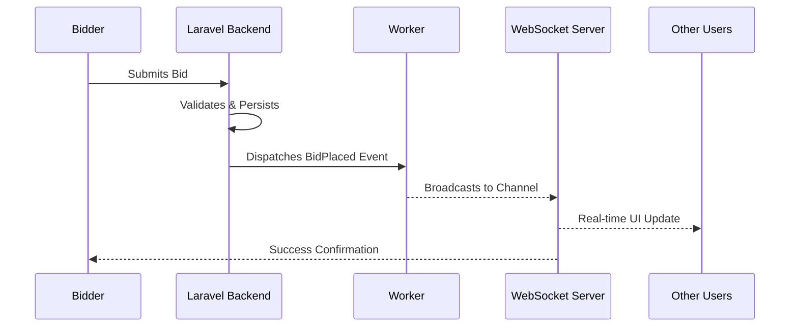

<div align="center">


# 🔨 AuctionHouse

[](https://laravel.com)
[](https://vuejs.org)
[](https://tailwindcss.com)
[](https://reverb.laravel.com)
[](LICENSE)

**A premium, high-performance real-time auction platform.**
Built for speed, modern UX, and seamless live interactions.

</div>

---

## ✨ Key Features

### 🚀 Real-time Core
*   **Live Bidding**: Powered by **Laravel Reverb**. Watch updates happen instantly.
*   **Smart Notifications**: Real-time "Outbid" alerts and status synchronization.
*   **Instant Messaging**: Integrated chat system for every auction thread.
*   **User Profiles**: Comprehensive user dashboard with activity tracking, wins, and bidding history.
*   **Seller Tools**: Automated notifications and contact handling for ended auctions.

### 💎 User Experience
*   **3-Step Creation Flow**: Intuitive, frictionless auction builder.
*   **Image Management**: Advanced drag & drop reordering and gallery previews.
*   **Intelligent Discovery**: category-based search with advanced price and status filters.
*   **Smart Relisting**: One-click reactivation of ended auctions.

### 🌍 Infrastructure
*   **Dual-Language**: Full **English** & **Polish** support.
*   **Next-Gen Styling**: Built with the latest Tailwind CSS 4 features.
*   **Adaptive Theme**: High-contrast Dark & Light mode support.

---

## 🏗 Real-time Architecture

Our bidding engine ensures sub-second latency across all connected clients:



---

## 🛠 Tech Stack

| Layer | Technology |
| :--- | :--- |
| **Backend** | Laravel 11 (PHP 8.2+) |
| **Frontend** | Vue 3 (Composition API), Typescript |
| **Bridge** | Inertia.js |
| **Styling** | Tailwind CSS 4.0 |
| **Broadcasting** | Laravel Reverb (WebSockets) |
| **State** | Pinia |
| **Icons** | Lucide Vue Next |

---

## 🚦 Getting Started

### 1. Requirements
*   PHP 8.2+ & Node.js 20+
*   Composer & NPM
*   SQLite / MySQL / PostgreSQL

### 2. Installation
```bash
# Clone and enter
git clone https://github.com/KenjiWriter/auctionhouse.git
cd auctionhouse

# Install dependencies
composer install && npm install

# Environment setup
cp .env.example .env
php artisan key:generate

# Database & Storage setup
php artisan migrate --seed
php artisan storage:link
```

### 3. Running the Development Services
For the full real-time experience, run these in separate terminal windows:

| Command | Role |
| :--- | :--- |
| `php artisan serve` | PHP Web Server |
| `npm run dev` | Asset Bundling (Vite) |
| `php artisan reverb:start` | WebSocket Server |
| `php artisan queue:work` | Async Event Processing |

> [!CAUTION]
> **Broadcasting Warning**: Real-time updates (bidding/chat) will **not trigger** unless the Queue Worker and Reverb Server are running simultaneously.

---

## 🧪 Development & Testing

**Simulate Bid Traffic**:
Testing real-time features locally is easy with our manual dispatch command:
```bash
php artisan test:bid-event {auction_id}
```

---

## 📄 License

This project is licensed under the [MIT license](https://opensource.org/licenses/MIT).
